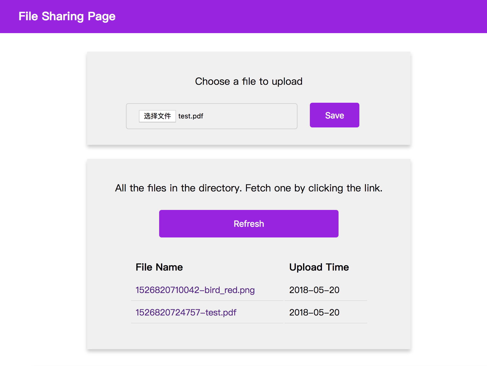

## Telia Web Development Assignment

### Ke Wang


### How to build
```
cd telia-test-app/app
npm install
npm start
```
You can now view app in the browser at localhost:3000/

### App design

This file uploading && fetching UI app is supported by Firebase API for Storage and Real-time Database.

The two functionalities this app has are: 

- uploading file to Firebase Storage
- Listing all files in the directory, and fetching the file by the specific URL from Firebase Storage

Since Firebase Storage API doesn't support to list all the files, the app leverages Firebase Database to store each uploaded file metadata with a URL for downloading. 


For convenience of viewing and testing the app, users are given full permission for writing and reading the data from the backend.

### Screenshot



